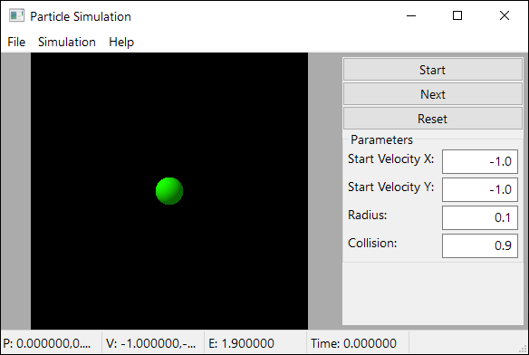
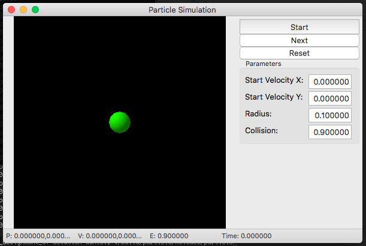
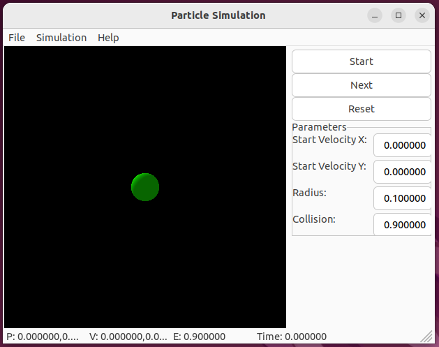

# Assignment 05: Particle simulation

## Summary

In this assignment students must complete the "Particle Simulation" app.
This a graphical application that simulates the physics of a 2-dimensional
particle moving under constant acceleration and varying initial conditions.

Students must complete the code to make the application functional.
A reference complete application is provided in Canvas for Windows, macOS,
and Ubuntu operating systems. Students should use those to compare to their
own implementation.

Additional instructions and example code will be discussed in lecture and/or
notes uploaded to Canvas.

The completed application looks like this:

Windows 10

macOS High Sierra

Ubuntu 22.04.3

## Grading

For this assignment, autograding verifies only that the submitted code
compiles correctly. Grading will be done by manual code inspection and
testing.

## General Instructions (command line)

These are generic instructions about how to compile the assignment from
a command-line window.

1. Download the starter code using `git clone <your repository url>`.
2. Open a command line shell and execute `./build.sh` or `build.bat` to
generate the project files using `CMake` and compile the provided code.
3. Open any file you want edit with a text editor or C++ development
environment (e.g. Visual Studio, Xcode) and add your code to them.
4. Compile your code again with `./build.sh`or `build.bat`, or using the
development environment.
5. Execute the programs and verify they work as expected based on the
specific instructions for each problem.
6. Repeat steps 3-5 as many times as desired.
7. Once you are satisfied with the result, save your changes using a
`git commit` command. For example `git commit -a -m "Complete assignment"`.
8. Upload your assignment using `git push`.

You can use `git commit` and/or `git push` as many times as desired, either
to save work in progress or to improve your code incrementally.

## Visual Studio Code

VSCode can be used to complete the assignment and in replacement of some
of the steps in the command-line instructions. Detailed steps were given
during lecture. A quick summary is to clone the repository as in step 1,
then use "Open Folder" in VSCode to open the cloned repo.

## Student comments

A file named `NOTES.txt` is included in this repository. Students may use
this file to write any comment about the assignment and its solution.

## Ubuntu/Wayland

Building on Ubuntu with Wayland requires GTK3+ libraries. They can be installed
like this:

    sudo apt install libgtk-3-dev

Effort has been made to ensure the assignment works but very limited testing was
done on this platform. Please report back if you encounter any problems while
building or running this assignment.
